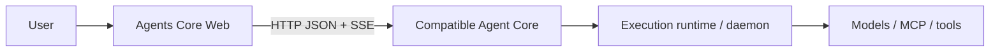

# Agents Core Web

**English** | [简体中文](README.zh-CN.md)

An open-source web console for creating Agents and running durable conversations
on Parsar Agent Core or another compatible Agents API Core.

## What it is

Agents Core Web gives an independently deployed Agent Core a focused browser UI
and a reusable TypeScript client. The Core remains responsible for authentication,
persistence, scheduling, and execution; this project does not embed or reimplement it.

## What you can do

- Create, view, edit, and delete reusable Agent configurations.
- Start durable Sessions and inspect their saved Items.
- Follow live progress over SSE and recover persisted output after reconnecting.
- Cancel active work and return function results or errors.
- Use the same Web client with Parsar Core or another proven-compatible Core.

## Compatible Agent Cores

| Core or interface | Can Web connect? | Notes |
| --- | --- | --- |
| [Parsar Agents API Core](https://github.com/MiniMax-AI-Dev/parsar/tree/main/services/agents-api) | Yes | Primary tested integration |
| Another Core implementing the tested `/v1/agents/**` HTTP/SSE subset | Yes | It must match the resources and behavior in [protocol coverage](docs/protocol-coverage.md) |
| OpenAI's hosted Agents API | Not claimed | This project does not promise complete hosted-API compatibility |
| OpenAI Agents SDK, Responses API, or Parsar daemon WebSocket | No | They are an SDK interface, a model API, and an internal execution interface—not directly connectable Core protocols |

Web speaks a tested subset of the [OpenAI Agents API](https://developers.openai.com/api/docs/guides/agents)
beta HTTP resource shape:
JSON requests and authenticated SSE under `/v1/agents/**`, with
`OpenAI-Beta: agents=v1`. Compatibility means this documented and tested subset,
not merely accepting the header or sharing similar names.

## Start Web with an existing Core

You need Node.js 22.12+, pnpm 10.30.3, a running compatible Agent Core, and a
caller bearer issued or configured by that Core's operator. For working chat,
the Core must also have a configured execution path.

Clone and start the Web:

```bash
git clone https://github.com/MiniMax-AI-Dev/agents-core-web.git
cd agents-core-web
pnpm install
pnpm dev
```

The default local setup expects:

- Agent Core at `http://127.0.0.1:8091`;
- browser requests through the same-origin `/v1` proxy;
- the plaintext caller bearer at `~/.parsar/agents-api/web-token`, read only by
  the local Vite server.

Open the loopback URL printed by Vite. Keep the connection base at `/v1`; when
**Server-managed Core key active** appears, leave the browser token field empty.

To use another server target or private key file, copy `.env.example` to
`.env.local` and set these optional server-side variables:

```dotenv
AGENTS_API_PROXY_TARGET=http://127.0.0.1:8091
AGENTS_API_PROXY_TOKEN_FILE=/absolute/private/path/to/web-token
```

Restart `pnpm dev` after changing them. Keep credentials server-side. A direct
Core URL in the connection dialog is only for a compatible Core that explicitly
allows the Web origin, methods, and headers through CORS.

Do not have a Core running yet? Use the immutable
[current Parsar setup guide](https://github.com/MiniMax-AI-Dev/parsar/blob/d91ba48ac6c49cfdf6f08d7687b9be76ba6d53ee/services/agents-api/README.md#standalone-http-service).
The repository's [legacy Web connection runbook](docs/core-connection.md) is pinned
to the older revision stated at its top; revalidate its PostgreSQL, caller-key,
device, daemon, native-harness, `CODEX_HOME`, verification, and shutdown steps before
applying them to a newer Core.

## First use

1. Open **Agents** and create an Agent with a name, instructions, and model ID.
2. Review, edit, or delete the saved Agent, or start a Session from it.
3. Open **Sessions**, select the Session, and send a message.
4. Follow live Items, cancel active work, or return a requested function result.

The model ID must be supported by the connected execution runtime. Core currently
has no model-catalog endpoint, so Web suggestions are editable hints rather than
availability guarantees. Successfully saving an Agent proves configuration storage,
not that a daemon, model, or provider credential can execute it.

## Relationship to Parsar



[Parsar](https://github.com/MiniMax-AI-Dev/parsar) owns its standalone Agents API
Core, `parsar-daemon`, and native Codex/Claude execution adapters. This repository
owns only the open Web experience and `@agents-core-web/agents-client`. The browser
connects to the Core protocol; it never uses the daemon WebSocket as its API URL.

See [Architecture](docs/architecture.md) for the full component and trust boundaries.

## Common problems

| Symptom | What to check |
| --- | --- |
| Web cannot reach Core | Confirm the Core address and `AGENTS_API_PROXY_TARGET`, then restart Vite |
| `401 invalid_api_key` | The plaintext caller bearer must match the current Core key binding |
| `503 execution_unavailable` / `Execution is not enabled` | Core rejected execution; inspect its safe error plus runtime and ownership state. A worker, executor, or daemon may be unconfigured or disconnected, or an execution lease may have been lost |
| Agent saves but its model fails | Use a model ID and provider credential supported by the connected runtime |

`/healthz` proves HTTP liveness only, not chat readiness. Check durable Core state and
the current pinned Parsar guide before retrying an uncertain request; the
[legacy 043 troubleshooting snapshot](docs/core-connection.md#troubleshooting) is
historical context only.

## Documentation

- [Current Parsar Core setup](https://github.com/MiniMax-AI-Dev/parsar/blob/d91ba48ac6c49cfdf6f08d7687b9be76ba6d53ee/services/agents-api/README.md#standalone-http-service) — immutable current upstream guide
- [Legacy Web connection runbook](docs/core-connection.md) — historical `0438880` snapshot; revalidate before use
- [Protocol coverage](docs/protocol-coverage.md) — exact supported API surface
- [Architecture](docs/architecture.md) — ownership, runtime, and trust boundaries
- [Roadmap](docs/roadmap.md) — planned Web and Core integrations
- [Issue-driven iteration](docs/self-iteration.md) — contributor automation contract
- [Contributor policy](AGENTS.md) — repository scope, safety, and quality requirements

Agents Core Web is available under the [MIT License](LICENSE).
