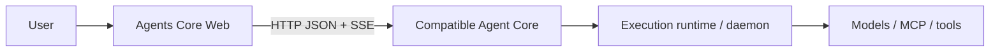

# Agents Core Web

**English** | [简体中文](README.zh-CN.md)

An open-source web console for creating Agents and running durable conversations
on Parsar Agent Core or another compatible Agents API Core.

## What it is

Agents Core Web gives an independently deployed Agent Core a focused browser UI
and a reusable TypeScript client. The Core remains responsible for authentication,
persistence, scheduling, and execution; this project does not embed or reimplement it.

## What you can do

- Create, view, edit, and delete reusable Agent configurations.
- Start durable Sessions with optional text input, metadata, and bounded
  Session-only Agent overrides, then inspect their saved Items.
- Show Sessions for all Agents or use a server-side root-Agent filter.
- Optionally create a Codex `self_hosted` Session and follow the connection state
  of an operator-managed Linux executor.
- Optionally create the basic Codex `openai_hosted` profile through an
  operator-qualified managed Runtime, inspect its exact Environment state, and
  list or explicitly add bounded `/workspace` files.
- Use Dashboard for the last Agent/Session results successfully traversed to
  Core's page-chain end marker, and System for live API reachability, pinned
  contract coverage, Source Files, and ownership boundaries.
- Follow live progress over SSE and recover persisted output after reconnecting.
- Cancel active work and return function results or errors.
- Use the same Web client with Parsar Core or another proven-compatible Core.

## Compatible Agent Cores

| Core or interface | Can Web connect? | Notes |
| --- | --- | --- |
| [Parsar Agents API Core at `dadf64a7`](https://github.com/MiniMax-AI-Dev/parsar/tree/dadf64a76bde58255281f3b6c3e939f8b556be09/services/agents-api) | Yes | Primary tested integration and immutable capability baseline |
| Another Core implementing the tested `/v1/agents/**` HTTP/SSE subset | Yes | It must match the resources and behavior in [protocol coverage](docs/protocol-coverage.md) |
| OpenAI's hosted Agents API | Not claimed | This project does not promise complete hosted-API compatibility |
| OpenAI Agents SDK, Responses API, or Parsar daemon WebSocket | No | They are an SDK interface, a model API, and an internal execution interface—not directly connectable Core protocols |

Web speaks a tested subset of the [OpenAI Agents API](https://developers.openai.com/api/docs/guides/agents)
beta HTTP resource shape:
JSON requests and authenticated SSE under `/v1/agents/**`, with
`OpenAI-Beta: agents=v1`. Compatibility means this documented and tested subset,
not merely accepting the header or sharing similar names.

The capability statements below are audited against immutable Parsar revision
[`dadf64a7`](https://github.com/MiniMax-AI-Dev/parsar/commit/dadf64a76bde58255281f3b6c3e939f8b556be09),
not a moving upstream branch.

## Start Web with an existing Core

You need Node.js 22.12+, pnpm 10.30.3, a running compatible Agent Core, and a
caller bearer issued or configured by that Core's operator. For working chat,
the Core must also have a configured execution path.

Clone and start the Web:

```bash
git clone https://github.com/MiniMax-AI-Dev/agents-core-web.git
cd agents-core-web
pnpm install
pnpm dev
```

The default local setup expects:

- Agent Core at `http://127.0.0.1:8091`;
- browser requests through the same-origin `/v1` proxy;
- the plaintext caller bearer at `~/.parsar/agents-api/web-token`, read only by
  the local Vite server.

Open the loopback URL printed by Vite. Keep the connection base at `/v1`; when
**Server-managed Core key active** appears, leave the browser token field empty.

To use another server target or private key file, copy `.env.example` to
`.env.local` and set these optional server-side variables:

```dotenv
AGENTS_API_PROXY_TARGET=http://127.0.0.1:8091
AGENTS_API_PROXY_TOKEN_FILE=/absolute/private/path/to/web-token
```

Self-hosted Session creation is a public, non-secret operator opt-in and is hidden
by default. Enable it only for a reviewed Codex Core deployment whose executor
registry and externally reachable executor origin are configured:

```dotenv
AGENTS_CORE_WEB_SELF_HOSTED_SESSIONS=1
```

This flag is read when Vite starts or builds the Web. It exposes the supported
Session creation form; it does not probe Core capabilities or prove that an
executor, native runtime, model, or provider is ready. Restart `pnpm dev` after
changing it. Never place an executor key or any other credential in this variable.

Basic managed hosted Session creation is a separate default-off presentation
policy. Enable it only after the Core operator has installed and qualified the
pinned Codex Runtime image, configured a stable default managed provider, and
accepted its Docker isolation and model-provider boundary:

```dotenv
AGENTS_CORE_WEB_OPENAI_HOSTED_SESSIONS=1
```

This flag likewise does not discover Core configuration or prove Runtime, native
harness, model, provider, Function, or tool readiness. The Core may still reject
creation when no qualified provider is configured.

Keep credentials server-side. A direct Core URL in the connection dialog is only
for a compatible Core that explicitly allows the Web origin, methods, and headers
through CORS.

Do not have a Core running yet? Use the immutable
[current Parsar setup guide](https://github.com/MiniMax-AI-Dev/parsar/blob/dadf64a76bde58255281f3b6c3e939f8b556be09/services/agents-api/README.md#standalone-http-service).
The repository's [Web connection runbook](docs/core-connection.md) is pinned to the
same revision and separates ordinary daemon/self-hosted setup from the managed
Docker-hosted operator profile.

## First use

1. Open **Agents** and create an Agent with a name, instructions, and model ID.
2. Review, edit, or delete the saved Agent, or open **Start Session**. The default
   uses no Environment.
3. Optionally set a title, enter the first text message, or
   configure the bounded whole-field Agent overrides used only by this Session.
4. In **Sessions**, choose **All Agents** or one root Agent, select a Session, and
   continue the conversation.
5. Follow live Items, cancel active work, or return a requested function result.
6. Open **System → Source Files** to upload, retrieve, download, or delete one
   project-owned `user_data` file by its Core ID. Core has no Source Files list, so
   retain the returned ID; Web does not persist it across page reloads.

**Start Session** accepts an exact non-empty text string or an ordered array of user
messages containing `input_text` parts only. Message order and grouping are preserved;
images, attachments, non-user roles, and other content parts are not supported.
Meaningful input is sent by streaming `POST /v1/agents/sessions` with `stream:true`; Web consumes
that creation SSE while running durable reconciliation for Session, Item, and
eligible Environment state and starting the paginated Turn read independently. After
the POST settles, Web hands live updates off to `GET .../events`. Empty or
whitespace-only input is omitted and uses the JSON `stream:false` create path for
`none` and `self_hosted`, so the Session starts idle. Web deliberately uses creation
SSE for `openai_hosted`, including idle creation, so it can reconcile provisioning
events before handing off to `GET .../events`. The optional title becomes
`metadata.title`; Start Session does not expose additional metadata. Additional
string metadata remains editable from the actions for an existing Session and must
stay within the pinned Core limits. Never put credentials or secrets there.

Session-only Agent overrides are deliberately finite and whole-field based. Web can
replace `model`, set or clear `instructions`, replace the plain-text configuration,
reset saved-only `multi_agent`, `reasoning`, or `service_tier` values to Core
defaults, and inherit, clear, or fully replace `tools` through the same bounded
Function/HTTP MCP editor. Untouched fields are omitted. There is no arbitrary Agent
JSON editor or patch-style partial Tool update. Environment choices are no Environment,
separately enabled
`self_hosted`, and separately enabled basic `openai_hosted`; the managed choice is
blocked when the effective Agent contains MCP because hosted MCP is not qualified.

After a failed create, only an explicit unchanged retry reuses the in-memory
idempotency key. The stable request fingerprint covers `agent_id`, the finite `agent`
override when present, `environment`, exact optional `input`, normalized `metadata`,
`stream`, and sorted derived `vault_ids`; any change to that projected request
rotates the key. The Sessions root-Agent picker is also server-side: every
continuation request carries the same `agent_id`, while **All Agents** omits the
parameter instead of filtering an already loaded page in the browser.

If an HTTP MCP server needs a static bearer, open **Vaults**, create a Vault and a
write-only Credential for the exact HTTPS endpoint, then select it under
**Agent → HTTP MCP → Authentication**. When the Session starts, Web attaches the
owning Vault and never reads the token back. The option is shown only after the
connected Core successfully exposes the Vault catalog; catalog metadata alone is
not proof that the MCP server can be reached at runtime.

When the operator opt-in is enabled, **Start Session** also offers **Self-hosted**.
Its absolute Workspace path is on the executor host, not in the browser, Web server,
or `parsar-daemon` container. After Core creates the Session, Web can show a
launcher template built from that Session's Environment ID and executor origin. The
operator-issued executor credential file stays outside Web, and the launcher itself
runs on caller-managed Linux executor compute. See
[Connecting Agent Core](docs/core-connection.md#optional-self-hosted-session-creation)
for the exact boundary.

The separately opt-in `AGENTS_CORE_WEB_DOCKER_BACKEND_GUIDE=1` profile turns Dashboard
gateway failures into an explicit recovery entry point. For an existing stack, the
connection panel shows validated, copyable commands for the configured database, Core
API, and daemon containers plus the loopback health check. For first-time use, it shows
the Core image build command and immutable Parsar container/daemon setup links. Parsar
still requires operator-created database and credential state; Web never runs these
commands, accesses Docker, or invents secrets. Container names remain non-secret
operator configuration from `.env.example`.

For the reviewed local loopback stack, an operator can additionally enable the
default-off `AGENTS_CORE_WEB_DOCKER_GUIDE=1` profile and its required non-secret
`AGENTS_CORE_WEB_DOCKER_*` settings from `.env.example`. The connection panel then
offers a copyable Docker command alongside the native launcher. Web still never
reads the credential file or talks to Docker, and running the command can release
already queued paid input.

The Source Files surface is independent of Session Environment choice. For a complete
basic managed Session, Core provisions the `openai_hosted` Runtime automatically;
Web shows its managed ID, enabled/disabled network policy, empty startup-install
metadata, and durable/live status. Workspace file controls are independently
default-off; set `AGENTS_CORE_WEB_ENVIRONMENT_FILES=1` only after qualifying the
connected Core Files.list and managed Files.create APIs. Managed reads use
`/workspace`; self-hosted reads use the
exact Session `workspace_directory`. Web never shows a
self-hosted launcher or caller connection action for that profile. Inline writes in
the Session panel and Source-ID copies in System appear only after an exact current
`openai_hosted` resource read confirms a non-terminal status and empty
files/plugins/skills metadata. Missing write responses are never replayed. Templates,
restricted domains, populated startup installs, hosted MCP, readiness discovery, and
other hosted engines remain unavailable. `self_hosted` Workspace files remain
read-only. Docker is Core's private managed Runtime adapter, not another public
Environment discriminator.

The model ID must be supported by the connected execution runtime. Core currently
has no model-catalog endpoint, so Web suggestions are editable hints rather than
availability guarantees. Successfully saving an Agent proves configuration storage,
not that a daemon, model, or provider credential can execute it.

## Relationship to Parsar



[Parsar](https://github.com/MiniMax-AI-Dev/parsar) owns its standalone Agents API
Core, `parsar-daemon`, and native Codex/Claude execution adapters. This repository
owns only the open Web experience and `@agents-core-web/agents-client`. The browser
connects to the Core protocol; it never uses the daemon WebSocket as its API URL.
For `self_hosted`, a separate operator-managed Linux executor connects to Core with
its own credential and runs commands in its own Workspace; neither Web nor the daemon
container becomes that Environment.

See [Architecture](docs/architecture.md) for the full component and trust boundaries.

## Common problems

| Symptom | What to check |
| --- | --- |
| Web cannot reach Core | Confirm the Core address and `AGENTS_API_PROXY_TARGET`, then restart Vite |
| `401 invalid_api_key` | The plaintext caller bearer must match the current Core key binding |
| `503 execution_unavailable` / `Execution is not enabled` | Core rejected execution; inspect its safe error plus runtime and ownership state. A worker, executor, or daemon may be unconfigured or disconnected, or an execution lease may have been lost |
| Agent saves but its model fails | Use a model ID and provider credential supported by the connected runtime |
| Self-hosted option is hidden | Set the non-secret `AGENTS_CORE_WEB_SELF_HOSTED_SESSIONS=1` operator flag and restart/rebuild Web only after the connected Codex Core and executor path have been reviewed |
| Managed hosted option is hidden | Set `AGENTS_CORE_WEB_OPENAI_HOSTED_SESSIONS=1` and restart/rebuild Web only after the pinned Core managed Runtime provider has been qualified |
| Workspace files are hidden | Set `AGENTS_CORE_WEB_ENVIRONMENT_FILES=1` and restart/rebuild Web only after the connected Core Files.list plus managed Files.create routes and Environment profiles have been qualified |

`/healthz` proves HTTP liveness only, not chat readiness. Check durable Core state and
the current pinned Parsar guide before retrying an uncertain request; see the
[connection troubleshooting runbook](docs/core-connection.md#troubleshooting).

## Documentation

- [Current Parsar Core setup](https://github.com/MiniMax-AI-Dev/parsar/blob/dadf64a76bde58255281f3b6c3e939f8b556be09/services/agents-api/README.md#standalone-http-service) — immutable current upstream guide
- [Web connection runbook](docs/core-connection.md) — matching `dadf64a7` operator and browser boundary
- [Protocol coverage](docs/protocol-coverage.md) — exact supported API surface
- [Architecture](docs/architecture.md) — ownership, runtime, and trust boundaries
- [Roadmap](docs/roadmap.md) — planned Web and Core integrations
- [Issue-driven iteration](docs/self-iteration.md) — contributor automation contract
- [Contributor policy](AGENTS.md) — repository scope, safety, and quality requirements

Agents Core Web is available under the [MIT License](LICENSE).
