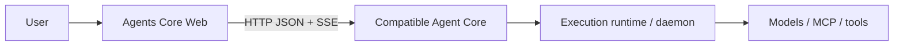

# Agents Core Web

[English](README.md) | **简体中文**

一个开源 Web 控制台，用于在 Parsar Agent Core 或其他兼容的 Agents API Core
上创建 Agent 并运行持久化对话。

## 这是什么

Agents Core Web 为独立部署的 Agent Core 提供专用的浏览器界面和可复用的
TypeScript 客户端。鉴权、持久化、调度和执行仍由 Core 负责；本项目不内置或
重新实现 Agent Core。

## 能做什么

- 创建、查看、编辑和删除可复用的 Agent 配置。
- 启动可带初始文本、可选标题和有限 Session 级 Agent 覆盖的持久化 Session，
  并查看其中保存的 Item。
- 查看所有 Agent 的 Session，或使用服务端 root-Agent 筛选。
- 可选创建 Codex `self_hosted` Session，并查看运维方管理的 Linux executor 连接状态。
- 可选通过运维方已验收的 managed Runtime 创建基础 Codex `openai_hosted`
  Session，查看精确 Environment 状态，并显式列出或添加有界 `/workspace` 文件。
- 通过 Dashboard 查看最近一次成功遍历到 Core 分页结束标记的 Agent/Session
  加载结果，通过 System 查看实时 API 可达性、固定契约范围、Source Files 和所有权边界。
- 通过 SSE 查看实时进度，并在重连后恢复已持久化的输出。
- 取消正在执行的任务，并回传函数执行结果或错误。
- 使用同一个 Web 客户端连接 Parsar Core 或其他经验证兼容的 Core。

## 兼容哪些 Agent Core

| Core 或接口 | Web 能否连接？ | 说明 |
| --- | --- | --- |
| [`dadf64a7` 的 Parsar Agents API Core](https://github.com/MiniMax-AI-Dev/parsar/tree/dadf64a76bde58255281f3b6c3e939f8b556be09/services/agents-api) | 可以 | 主要且经过测试的集成，也是不可变能力基线 |
| 实现了 `/v1/agents/**` 已测试 HTTP/SSE 子集的其他 Core | 可以 | 必须符合[协议覆盖范围](docs/protocol-coverage.md)记录的资源和行为 |
| OpenAI 托管的 Agents API | 不作承诺 | 本项目不承诺与托管 API 完全兼容 |
| OpenAI Agents SDK、Responses API 或 Parsar daemon WebSocket | 不可以 | 它们分别是 SDK 接口、模型 API 和内部执行接口，不是可直接连接的 Core 协议 |

Web 使用 [OpenAI Agents API](https://developers.openai.com/api/docs/guides/agents)
beta HTTP 资源形态中经过测试的子集：
`/v1/agents/**` 下的 JSON 请求和鉴权 SSE，并携带
`OpenAI-Beta: agents=v1`。这里的兼容是指已记录、已测试的子集，
仅仅接受该请求头或名称相似，并不代表兼容。

下文所有能力说明都以不可变 Parsar revision
[`dadf64a7`](https://github.com/MiniMax-AI-Dev/parsar/commit/dadf64a76bde58255281f3b6c3e939f8b556be09)
为审计基线，而不是跟随变化的上游分支。

## 已有 Core 时启动 Web

你需要 Node.js 22.12+、pnpm 10.30.3、一个正在运行的兼容 Agent Core，
以及由该 Core 运维方提供或配置的调用方 Bearer 凭据。要正常聊天，Core 还必须
具备已配置的执行链路。

克隆并启动 Web：

```bash
git clone https://github.com/MiniMax-AI-Dev/agents-core-web.git
cd agents-core-web
pnpm install
pnpm dev
```

默认本地配置为：

- Agent Core 位于 `http://127.0.0.1:8091`；
- 浏览器请求通过同源 `/v1` 代理；
- 明文调用方 Bearer 凭据位于 `~/.parsar/agents-api/web-token`，且只由本地
  Vite 服务器读取。

打开 Vite 输出的本机回环 URL。连接地址保持为 `/v1`；看到
**Server-managed Core key active** 时，浏览器 token 输入框应保持为空。

如需使用其他服务地址或私密调用方凭据文件，请将 `.env.example` 复制为
`.env.local`，并设置以下可选的服务端变量：

```dotenv
AGENTS_API_PROXY_TARGET=http://127.0.0.1:8091
AGENTS_API_PROXY_TOKEN_FILE=/absolute/private/path/to/web-token
```

Self-hosted Session 创建是默认隐藏的非秘密运维开关。只有已经核对 Codex Core、
executor registry 和 executor origin 的部署才应启用：

```dotenv
AGENTS_CORE_WEB_SELF_HOSTED_SESSIONS=1
```

该开关只暴露已支持的表单，不会探测 Core 能力，也不能证明 executor、原生运行时、
模型或提供商已就绪。不得在其中放入 executor key 或其他凭据。

基础 managed hosted Session 创建使用另一个默认关闭的展示开关。只有 Core 运维方已
安装并验收固定 Codex Runtime 镜像、配置稳定的默认 managed provider，并接受 Docker
隔离和模型提供商边界后才启用：

```dotenv
AGENTS_CORE_WEB_OPENAI_HOSTED_SESSIONS=1
```

该开关同样不会发现 Core 配置，也不能证明 Runtime、原生 harness、模型、提供商、
Function 或 Tool 已就绪。Core 未配置合格 provider 时仍会拒绝创建。

修改后重启 `pnpm dev`。凭据应保留在服务端。只有兼容 Core 通过 CORS
明确允许 Web 的源、方法和请求头时，才能在连接对话框中使用 Core 直连 URL。

还没有运行中的 Core？请使用不可变的
[当前 Parsar 配置指南](https://github.com/MiniMax-AI-Dev/parsar/blob/dadf64a76bde58255281f3b6c3e939f8b556be09/services/agents-api/README.md#standalone-http-service)。
仓库内的 [Web 连接手册](docs/core-connection.md)固定在同一 revision，并区分普通
daemon/self-hosted 配置与 managed Docker-hosted 运维 profile。

## 第一次使用

1. 打开 **Agents**，使用名称、指令（instructions）和 model ID 创建 Agent。
2. 查看、编辑或删除已保存的 Agent，或打开 **Start Session**；默认不使用
   Environment。
3. 可以设置标题、输入第一条文本消息，或配置只作用于该 Session
   的有限 whole-field Agent 覆盖。
4. 在 **Sessions** 中选择 **All Agents** 或一个 root Agent，再选择 Session 并继续对话。
5. 查看实时 Item、取消正在执行的任务，或回传请求的函数结果。
6. 打开 **System → Source Files**，按 Core 返回的 ID 上传、查询、下载或删除一个
   project-owned `user_data` 文件。Core 没有 Source Files 列表，Web 也不会在刷新后
   持久保存该 ID。

**Start Session** 接受精确保留的非空文本字符串，或按原顺序排列、仅包含
`input_text` part 的 user message 数组；不支持图片、附件、非 user role 或其他
content part。有效输入通过带 `stream:true` 的流式 `POST /v1/agents/sessions` 发送；Web 一边消费创建 SSE，一边对
Session、Item 和合格 Environment 的持久状态执行协调，并独立启动 Turn 分页读取。
POST 结束后，Web 把实时更新交接给 `GET .../events`。对 `none` 和 `self_hosted`，
空输入或纯空白输入会被省略并走 JSON `stream:false` 创建路径，因此 Session 以 idle
状态开始。Web 对 `openai_hosted`（包括 idle 创建）固定使用创建 SSE，以便在交接到
`GET .../events` 前协调 provisioning 事件。可选标题写入 `metadata.title`；
Start Session 不再暴露额外 metadata。额外字符串 metadata 仍可在已有 Session 的
Actions 中编辑，并须符合固定 Core 限制；其中绝不能放入凭据或秘密。

Session 级 Agent 覆盖是有限且按 whole-field 生效的集合：Web 可以替换 `model`、
设置或清空 `instructions`、替换纯文本配置，将 saved-only 的 `multi_agent`、
`reasoning` 或 `service_tier` 重置为 Core 默认值，并通过同一套受限的
Function/HTTP MCP 编辑器继承、清空或完整替换 `tools`。未操作的字段不会发送；
这里没有任意 Agent JSON 编辑器，也不提供 patch 风格的局部 Tool 更新。
Environment 选项包括无 Environment、单独启用的 `self_hosted` 和单独启用的基础
`openai_hosted`；effective Agent 含 MCP 时 managed
选项会被阻止，因为 hosted MCP 尚未验收。

创建失败后，只有显式发起且请求未变化的重试才会复用内存中的幂等 key。稳定
request fingerprint 完整覆盖 `agent_id`、存在时的有限 `agent` 覆盖、
`environment`、精确可选 `input`、规范化 `metadata`、`stream` 和排序后的派生
`vault_ids`；投影请求发生任何变化都会换 key。Sessions 的 root-Agent 选择器同样在
服务端生效：每个分页请求都携带相同 `agent_id`，而 **All Agents** 会省略该参数，
不是在浏览器中只筛选已经加载的一页。

HTTP MCP 需要静态 Bearer 时，先在 **Vaults** 中为精确 HTTPS 地址创建 Vault 和
只写 Credential，再在 **Agent → HTTP MCP → Authentication** 中选择它。创建 Session
时 Web 会附加所属 Vault，且永不读回 token。只有连接的 Core 成功暴露完整 Vault
catalog 后才会显示这项能力；catalog 元数据本身不能证明运行时可访问 MCP 服务。

启用运维开关后，**Start Session** 还会提供 **Self-hosted**。Workspace 是 executor
主机或容器中的绝对路径，不是浏览器、Web 服务或 daemon 容器的目录。Web 只展示
Core 返回的 Environment ID、executor origin、连接状态和安全 launcher 模板；
运维方签发的 executor credential 文件始终留在 Web 之外。完整边界见
[连接 Agent Core](docs/core-connection.md#optional-self-hosted-session-creation)。

可单独启用 `AGENTS_CORE_WEB_DOCKER_BACKEND_GUIDE=1`。Dashboard 遇到网关错误时会明确
提示 Core 后端未就绪。已有容器时，连接面板会根据 `.env.example` 中经过校验的非秘密
容器名，展示数据库、Core API、daemon 和 loopback 健康检查的可复制命令；首次使用时，
则展示 Core 镜像构建命令以及固定 Parsar 版本的容器和 daemon 初始化文档。Parsar 首次
初始化仍需要运维方创建独立数据库和凭据，Web 不执行命令、不访问 Docker，也不猜测密钥。

对于已核对的本地 loopback 栈，还可以配置 `.env.example` 中默认关闭的
`AGENTS_CORE_WEB_DOCKER_GUIDE=1` 以及完整的非秘密 `AGENTS_CORE_WEB_DOCKER_*`
参数。连接面板会在原生 launcher 之外提供可复制的 Docker 命令；Web 仍不会读取
credential 文件或访问 Docker。若 Session 已有排队输入，运行命令可能立即触发付费调用。

Source Files 与 Session 是否使用 Environment 无关。对于完整的基础 managed Session，
Core 会自动配置 `openai_hosted` Runtime；Web 展示 managed ID、enabled/disabled 网络
策略、空 startup-install 元数据、durable/live 状态和显式 `/workspace` 文件列表，绝不
展示 self-hosted launcher 或调用方连接动作。Session 内联写入和 System 中的 Source-ID
复制只有在精确查询当前 `openai_hosted` resource、确认非 terminal 状态且
files/plugins/skills 元数据为空后才显示；写入响应丢失时不会重放。Templates、受限域名、
非空启动安装、hosted MCP、readiness discovery 和其他 hosted engine 仍不可用。
`self_hosted` Workspace Files 继续只读。Docker 是 Core 的私有 managed Runtime adapter，
不是另一个公开 Environment discriminator。

model ID 必须由已连接的执行运行时支持。Core 当前没有模型目录接口，
因此 Web 建议项只是可编辑提示，不代表模型一定可用。成功保存 Agent 只能证明
配置已持久化，不能证明 daemon、模型或提供商凭据能够实际执行它。

## 与 Parsar 的关系



[Parsar](https://github.com/MiniMax-AI-Dev/parsar) 负责其独立的 Agents API Core、
`parsar-daemon` 以及原生 Codex/Claude 执行适配器。本仓库只负责开源 Web 体验和
`@agents-core-web/agents-client`。浏览器连接的是 Core 协议，绝不会把 daemon
WebSocket 当作 API URL。

完整的组件和信任边界参见[架构说明](docs/architecture.md)。

## 常见问题

| 现象 | 检查内容 |
| --- | --- |
| Web 无法访问 Core | 确认 Core 地址和 `AGENTS_API_PROXY_TARGET`，然后重启 Vite |
| `401 invalid_api_key` | 明文调用方 Bearer 凭据必须与 Core 当前的密钥绑定匹配 |
| `503 execution_unavailable` / `Execution is not enabled` | Core 拒绝执行；请检查其安全错误、运行时和 ownership 状态。worker、executor 或 daemon 可能未配置或已断连，也可能丢失了执行 lease |
| Agent 保存成功但模型运行失败 | 使用已连接运行时支持的 model ID 和提供商凭据 |
| Self-hosted 选项未显示 | 只有核对兼容 Codex Core 与 executor 链路后，设置非秘密 `AGENTS_CORE_WEB_SELF_HOSTED_SESSIONS=1` 并重启或重建 Web |
| Managed hosted 选项未显示 | 只有固定 Core 的 managed Runtime provider 已验收后，设置 `AGENTS_CORE_WEB_OPENAI_HOSTED_SESSIONS=1` 并重启或重建 Web |
| Workspace files 未显示 | 只有已验收当前 Core 的 Files.list、managed Files.create 和 Environment profile 后，设置 `AGENTS_CORE_WEB_ENVIRONMENT_FILES=1` 并重启或重建 Web；self-hosted 使用 Session 返回的实际 `workspace_directory` |

`/healthz` 只能证明 HTTP 存活，不能证明聊天已就绪。重试结果不确定的请求前，
请先核对 Core 持久状态和当前固定版本的 Parsar 指南；参见
[连接故障排查手册](docs/core-connection.md#troubleshooting)。

## 文档入口

- [当前 Parsar Core 配置](https://github.com/MiniMax-AI-Dev/parsar/blob/dadf64a76bde58255281f3b6c3e939f8b556be09/services/agents-api/README.md#standalone-http-service) — 不可变的当前上游指南
- [Web 连接手册](docs/core-connection.md) — 对齐 `dadf64a7` 的运维和浏览器边界
- [协议覆盖范围](docs/protocol-coverage.md) — 准确的已支持 API 范围
- [架构说明](docs/architecture.md) — 所有权、运行时和信任边界
- [路线图](docs/roadmap.md) — 计划中的 Web 和 Core 集成
- [Issue 驱动的自迭代](docs/self-iteration.md) — 贡献者自动化约定
- [贡献者规范](AGENTS.md) — 仓库范围、安全和质量要求

Agents Core Web 采用 [MIT License](LICENSE)。
