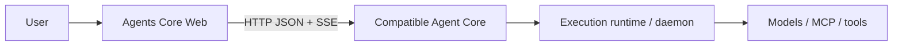

# Agents Core Web

[English](README.md) | **简体中文**

一个开源 Web 控制台，用于在 Parsar Agent Core 或其他兼容的 Agents API Core
上创建 Agent 并运行持久化对话。

## 这是什么

Agents Core Web 为独立部署的 Agent Core 提供专用的浏览器界面和可复用的
TypeScript 客户端。鉴权、持久化、调度和执行仍由 Core 负责；本项目不内置或
重新实现 Agent Core。

## 能做什么

- 创建、查看、编辑和删除可复用的 Agent 配置。
- 启动持久化 Session，并查看其中保存的 Item。
- 可选创建 Codex `self_hosted` Session，并查看运维方管理的 Linux executor 连接状态。
- 通过 SSE 查看实时进度，并在重连后恢复已持久化的输出。
- 取消正在执行的任务，并回传函数执行结果或错误。
- 使用同一个 Web 客户端连接 Parsar Core 或其他经验证兼容的 Core。

## 兼容哪些 Agent Core

| Core 或接口 | Web 能否连接？ | 说明 |
| --- | --- | --- |
| [Parsar Agents API Core](https://github.com/MiniMax-AI-Dev/parsar/tree/main/services/agents-api) | 可以 | 主要且经过测试的集成 |
| 实现了 `/v1/agents/**` 已测试 HTTP/SSE 子集的其他 Core | 可以 | 必须符合[协议覆盖范围](docs/protocol-coverage.md)记录的资源和行为 |
| OpenAI 托管的 Agents API | 不作承诺 | 本项目不承诺与托管 API 完全兼容 |
| OpenAI Agents SDK、Responses API 或 Parsar daemon WebSocket | 不可以 | 它们分别是 SDK 接口、模型 API 和内部执行接口，不是可直接连接的 Core 协议 |

Web 使用 [OpenAI Agents API](https://developers.openai.com/api/docs/guides/agents)
beta HTTP 资源形态中经过测试的子集：
`/v1/agents/**` 下的 JSON 请求和鉴权 SSE，并携带
`OpenAI-Beta: agents=v1`。这里的兼容是指已记录、已测试的子集，
仅仅接受该请求头或名称相似，并不代表兼容。

## 已有 Core 时启动 Web

你需要 Node.js 22.12+、pnpm 10.30.3、一个正在运行的兼容 Agent Core，
以及由该 Core 运维方提供或配置的调用方 Bearer 凭据。要正常聊天，Core 还必须
具备已配置的执行链路。

克隆并启动 Web：

```bash
git clone https://github.com/MiniMax-AI-Dev/agents-core-web.git
cd agents-core-web
pnpm install
pnpm dev
```

默认本地配置为：

- Agent Core 位于 `http://127.0.0.1:8091`；
- 浏览器请求通过同源 `/v1` 代理；
- 明文调用方 Bearer 凭据位于 `~/.parsar/agents-api/web-token`，且只由本地
  Vite 服务器读取。

打开 Vite 输出的本机回环 URL。连接地址保持为 `/v1`；看到
**Server-managed Core key active** 时，浏览器 token 输入框应保持为空。

如需使用其他服务地址或私密调用方凭据文件，请将 `.env.example` 复制为
`.env.local`，并设置以下可选的服务端变量：

```dotenv
AGENTS_API_PROXY_TARGET=http://127.0.0.1:8091
AGENTS_API_PROXY_TOKEN_FILE=/absolute/private/path/to/web-token
```

Self-hosted Session 创建是默认隐藏的非秘密运维开关。只有已经核对 Codex Core、
executor registry 和 executor origin 的部署才应启用：

```dotenv
AGENTS_CORE_WEB_SELF_HOSTED_SESSIONS=1
```

该开关只暴露已支持的表单，不会探测 Core 能力，也不能证明 executor、原生运行时、
模型或提供商已就绪。不得在其中放入 executor key 或其他凭据。

修改后重启 `pnpm dev`。凭据应保留在服务端。只有兼容 Core 通过 CORS
明确允许 Web 的源、方法和请求头时，才能在连接对话框中使用 Core 直连 URL。

还没有运行中的 Core？请使用不可变的
[当前 Parsar 配置指南](https://github.com/MiniMax-AI-Dev/parsar/blob/2b34ea4630a5a0daf90e745fe1af3edcfa4f0e9e/services/agents-api/README.md#standalone-http-service)。
仓库内的[旧版 Web 连接手册](docs/core-connection.md)固定在文首标注的旧 revision；
将其中 PostgreSQL、调用方凭据、执行设备、daemon、原生执行适配层（harness）、
`CODEX_HOME`、验证和停止流程用于更新版 Core 前必须重新核对。

## 第一次使用

1. 打开 **Agents**，使用名称、指令（instructions）和 model ID 创建 Agent。
2. 查看、编辑或删除已保存的 Agent，也可以从该 Agent 启动 Session。
3. 打开 **Sessions**，选择 Session 并发送消息。
4. 查看实时 Item、取消正在执行的任务，或回传请求的函数结果。

启用运维开关后，**Start Session** 还会提供 **Self-hosted**。Workspace 是 executor
主机或容器中的绝对路径，不是浏览器、Web 服务或 daemon 容器的目录。Web 只展示
Core 返回的 Environment ID、executor origin、连接状态和安全 launcher 模板；
运维方签发的 executor credential 文件始终留在 Web 之外。完整边界见
[连接 Agent Core](docs/core-connection.md#optional-self-hosted-session-creation)。

对于已核对的本地 loopback 栈，还可以配置 `.env.example` 中默认关闭的
`AGENTS_CORE_WEB_DOCKER_GUIDE=1` 以及完整的非秘密 `AGENTS_CORE_WEB_DOCKER_*`
参数。连接面板会在原生 launcher 之外提供可复制的 Docker 命令；Web 仍不会读取
credential 文件或访问 Docker。若 Session 已有排队输入，运行命令可能立即触发付费调用。

model ID 必须由已连接的执行运行时支持。Core 当前没有模型目录接口，
因此 Web 建议项只是可编辑提示，不代表模型一定可用。成功保存 Agent 只能证明
配置已持久化，不能证明 daemon、模型或提供商凭据能够实际执行它。

## 与 Parsar 的关系



[Parsar](https://github.com/MiniMax-AI-Dev/parsar) 负责其独立的 Agents API Core、
`parsar-daemon` 以及原生 Codex/Claude 执行适配器。本仓库只负责开源 Web 体验和
`@agents-core-web/agents-client`。浏览器连接的是 Core 协议，绝不会把 daemon
WebSocket 当作 API URL。

完整的组件和信任边界参见[架构说明](docs/architecture.md)。

## 常见问题

| 现象 | 检查内容 |
| --- | --- |
| Web 无法访问 Core | 确认 Core 地址和 `AGENTS_API_PROXY_TARGET`，然后重启 Vite |
| `401 invalid_api_key` | 明文调用方 Bearer 凭据必须与 Core 当前的密钥绑定匹配 |
| `503 execution_unavailable` / `Execution is not enabled` | Core 拒绝执行；请检查其安全错误、运行时和 ownership 状态。worker、executor 或 daemon 可能未配置或已断连，也可能丢失了执行 lease |
| Agent 保存成功但模型运行失败 | 使用已连接运行时支持的 model ID 和提供商凭据 |
| Self-hosted 选项未显示 | 只有核对兼容 Codex Core 与 executor 链路后，设置非秘密 `AGENTS_CORE_WEB_SELF_HOSTED_SESSIONS=1` 并重启或重建 Web |

`/healthz` 只能证明 HTTP 存活，不能证明聊天已就绪。重试结果不确定的请求前，
请先核对 Core 持久状态和当前固定版本的 Parsar 指南；
[旧版 043 故障排查快照](docs/core-connection.md#troubleshooting)仅供历史参考。

## 文档入口

- [当前 Parsar Core 配置](https://github.com/MiniMax-AI-Dev/parsar/blob/2b34ea4630a5a0daf90e745fe1af3edcfa4f0e9e/services/agents-api/README.md#standalone-http-service) — 不可变的当前上游指南
- [旧版 Web 连接手册](docs/core-connection.md) — 历史 `0438880` 快照，使用前必须重新核对
- [协议覆盖范围](docs/protocol-coverage.md) — 准确的已支持 API 范围
- [架构说明](docs/architecture.md) — 所有权、运行时和信任边界
- [路线图](docs/roadmap.md) — 计划中的 Web 和 Core 集成
- [Issue 驱动的自迭代](docs/self-iteration.md) — 贡献者自动化约定
- [贡献者规范](AGENTS.md) — 仓库范围、安全和质量要求

Agents Core Web 采用 [MIT License](LICENSE)。
