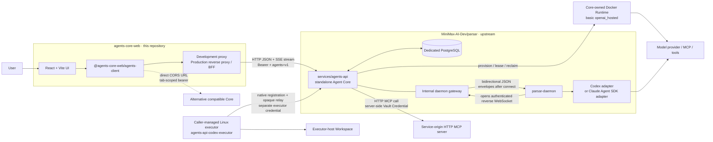

# Architecture

## Decision

Agents Core Web is a protocol-facing TypeScript application, not a second Agent runtime.
It owns the open-source web experience and a reusable client for the HTTP resources
it consumes. The standalone Agent Core, persistence, scheduling, execution devices,
and native harness adapters remain upstream in
[MiniMax-AI-Dev/parsar](https://github.com/MiniMax-AI-Dev/parsar).

This boundary is intentional:

- this repository can release and deploy its Web independently;
- Parsar `services/agents-api` can be deployed without the Parsar product service;
- another Core can replace Parsar only when it implements the same tested HTTP/SSE
  subset;
- Core fixes and runtime-provider work are contributed upstream instead of copied or
  simulated in Web.

The current immutable compatibility audit baseline is Parsar
[`dadf64a7`](https://github.com/MiniMax-AI-Dev/parsar/commit/dadf64a76bde58255281f3b6c3e939f8b556be09),
whose contract is pinned to `openai-python` 3.13.0 commit
[`d7c41efe`](https://github.com/openai/openai-python/tree/d7c41efee1b0802b79f3f88a678ef2052b06e9ce/src/openai/resources/beta/agents).
This is a fixed beta subset, not a claim that every current OpenAI Agents API
resource or hosted-service behavior is implemented.

## System context



The Parsar product stack is deliberately outside this runtime graph. There is no
product-login, product-database, or organization-service dependency in this open Web
deployment. A future Web Cloud service may add its own BFF and user/org policy, but
that is a separate product layer.

## Ownership

| Layer | Owns | Does not own |
| --- | --- | --- |
| Agents Core Web | navigation, Agent forms, Vault/Credential metadata controls, Session timeline, live-state projection, reconnect recovery, function-result UI | durable truth, Credential decryption, engine selection, sandbox or provider credentials |
| `@agents-core-web/agents-client` | `/v1/agents/**`, `/v1/vaults/**`, and Source `/v1/files**` wire types; route-specific beta/auth headers; pagination; strict Environment/File/Vault metadata projection; write-only Credential create/replace; fetch-based SSE parsing | uncertain-write retries, secret readback, native protocol translation |
| Agent Core | principal authentication, validation, idempotency, durable Agent/Session/Turn/Item and Vault/Credential truth, server-side Credential encryption/use, live events, scheduling | product organization UI or Web user sessions |
| `parsar-daemon` | device connection, host capability advertisement, native process lifecycle and translation | public Agents HTTP semantics or product policy |
| Native adapter | Codex app-server or Claude Agent SDK integration | public API and Web deployment policy |
| Self-hosted executor | native Codex command/file execution inside its process-user and sandbox boundary | browser UI, Core caller authentication, provider/model credentials |
| Managed Docker Runtime | one Core-owned Codex allocation, Workspace/native continuity, bounded networking and cleanup for `openai_hosted` | public readiness discovery, browser Docker control, templates, hosted MCP, arbitrary startup installs |
| Runtime/environment provider | allocation, attach, lease, recovery, cancellation, cleanup | conversation-resource semantics |

Docker, E2B, and AWS Bedrock AgentCore Runtime are possible core/runtime
implementations, not browser transports. Agents Core Web does not implement those adapters.
It may expose an option later only after the connected Core publishes a versioned
capability and its lifecycle behavior is verified.

## Protocol layers

| Boundary | Wire protocol | Authentication | Contract owner |
| --- | --- | --- | --- |
| Browser → proxy/BFF | Same-origin HTTP under `/v1` | Web deployment policy; local proxy holds a Core bearer | Agents Core Web deployment |
| Proxy/BFF → Core | HTTP JSON/SSE under `/v1/agents/**`; HTTP JSON under `/v1/vaults/**`; multipart/JSON/binary under `/v1/files**` | `Authorization: Bearer …`; route-specific `OpenAI-Beta: agents=v1` | Pinned Agents, Vault/Credential, and Source Files subset |
| Core ↔ daemon | Private reverse WebSocket, Parsar JSON envelope protocol | Separate device credential | Parsar internal protocol |
| Core ↔ self-hosted executor | Native registration plus opaque relay outside `/v1/agents/**` | Operator-issued executor principal credential | Parsar native executor contract |
| Daemon ↔ Codex | `codex app-server --stdio`; JSON-RPC 2.0 over newline-delimited JSON | Native host configuration | Codex adapter |
| Daemon ↔ Claude | Packaged Claude Agent SDK bridge | Native host configuration | Claude adapter |
| Core ↔ service-origin MCP | HTTP MCP transport | Optional Core-managed Vault static-bearer Credential attached through Session `vault_ids` | Core and selected MCP server |
| Harness ↔ model/tools | Provider-native APIs, MCP, and tool protocols | Provider credential on native harness host | Selected harness/provider |

These interfaces are not interchangeable. In particular:

- the daemon WebSocket URL is not an Agents API base URL;
- OpenAI Agents API is not the same thing as OpenAI Agents SDK or Responses API;
- saving a model ID does not select an executor or prove provider availability;
- a Session Environment ID, connection state, or copied launcher command does not
  prove native readiness, isolation, or completed execution;
- multiple saved Agents do not imply protocol multi-agent/Subagent support.

OpenAI's official [Agents guide](https://developers.openai.com/api/docs/guides/agents)
describes Agents API as an OpenAI-managed Codex harness, Agents SDK as an application-
hosted agent loop, and Responses API as the lower-level model interface. Parsar uses
the pinned Agents API resource shape while supplying its own Core and execution path.

## Session flow

```mermaid
sequenceDiagram
  participant W as Agents Core Web
  participant C as Agents API Core
  participant D as Selected executor / daemon
  participant H as Native harness

  alt meaningful initial input
    W->>C: POST /v1/agents/sessions<br/>{input, stream:true, ...} + idempotency key
    C-->>W: creation SSE begins with agent.session.created
    C->>D: select/bind first device or dispatch to bound device
    D->>H: start native Session/Turn
    H-->>D: native events, Items, and terminal state
    D-->>C: private execution envelopes
    C-->>W: live Session / Turn / Item events
    W->>C: GET Session + Items for durable reconciliation
    W->>C: start the paginated Turn read independently
    opt current Session has a valid self_hosted or openai_hosted Environment ID
      W->>C: GET Environment
    end
    C-->>W: creation SSE completes
    W->>C: GET .../events (live-stream handoff)
  else empty or whitespace-only initial input without managed hosting
    W->>C: POST /v1/agents/sessions<br/>{stream:false, no input, ...} + idempotency key
    C-->>W: durable idle agent.session JSON
    W->>C: GET .../events (live stream)
  end
  Note over W,C: SSE is live-only. Buffer new events while reconciling<br/>durable Session/Items/Environment; fence Turns independently.
```

The Start Session form accepts an exact non-empty text string or an ordered array of
user messages containing `input_text` parts only. Message order and grouping are
preserved; images, attachments, non-user roles, and other content parts are not
supported. Meaningful input selects the streaming create variant. The first creation event
must contain the canonical Session; Web buffers newer create-stream events while it
reconciles durable Session, Item, and eligible Environment state and starts the
all-pages Turn read independently. When the creation stream ends after that Session
is known, Web performs its required durable refresh and hands live updates to the
ordinary `GET .../events` stream. Turn pages apply later only if their fenced read is
still current; they do not block that handoff. A successful create is not by itself
proof that the initial native Turn completed. Empty or whitespace-only simple text is
omitted and selects the JSON `stream:false` variant for `none` and `self_hosted`.
Web deliberately uses creation SSE for `openai_hosted`, including idle creation,
so it can reconcile provisioning before the ordinary event-stream handoff.

Creation can also carry a title plus bounded string metadata. The title is stored as
`metadata.title`, and metadata must never contain secrets. A saved Agent remains the
root snapshot; Web may add a finite whole-field override that can replace `model`,
set or clear `instructions`, replace the supported plain-text configuration, reset
saved-only `multi_agent`, `reasoning`, or `service_tier` values to Core defaults, and
inherit, clear, or fully replace `tools` through the bounded Function/HTTP MCP editor.
Untouched fields are omitted. Web exposes neither arbitrary Agent JSON nor
patch-style partial Tool updates, and it does not admit images, attachments,
non-user roles, or non-`input_text` content parts.

The environment choice is likewise closed: no Environment by default, the separately
enabled Codex `self_hosted` profile, or the separately enabled basic Codex
`openai_hosted` profile described below. Before submission, admission checks and
Vault attachment derivation use the effective saved Agent plus those finite
Session-only overrides.

The Sessions root-Agent picker changes the Core query rather than filtering one
browser-loaded page. Core applies that root-Agent scope before pagination. A filtered
load sends the same `agent_id` on the first request and every opaque continuation
while preserving the page limit and order. **All Agents** omits `agent_id`. Filter
changes abort and fence stale collection reads; every accepted filtered Session must
snapshot the requested root Agent.

The default Session uses `environment:none`. With the default-off
`AGENTS_CORE_WEB_SELF_HOSTED_SESSIONS=1` operator flag, the same create boundary can
instead request a Codex `self_hosted` Environment with an absolute executor-host
Workspace and empty capability directories. Core returns its Session-scoped
Environment ID and executor origin. Web may render a launcher template from those
validated public fields, but an operator starts `agents-api-codex-executor` separately
on Linux with a private executor credential file. There is no browser-to-executor
connection.

An optional local-only Docker guide can format that same self-hosted projection with
an operator-configured, non-secret Docker profile. It remains copy-only: the browser
has no Docker socket, never reads the credential path, and never starts or observes
the container. This launcher guide is distinct from Parsar's managed Docker Runtime
adapter. That adapter is Core-internal execution placement behind the public
`openai_hosted` discriminator, not a browser transport or second public Environment
type. The generated self-hosted block binds an operator-selected host directory to the
exact executor Workspace path and keeps state under an Environment-specific host
directory. Core Environment reads and events remain the only connection truth.

Core persists the authoritative Session, Turn, Item, and supported Environment views.
Reconnecting SSE does not replay missed events, including when `Last-Event-ID` is
sent. The current UI therefore reconnects, buffers newly arriving events, retrieves
the Session and Items, starts the all-pages Turn read independently, retrieves
Environment only after that Session supplies a valid supported Environment ID, then applies
newer buffered live state. Turn results apply separately only while their read remains
current. A failed or malformed Environment read degrades only the Environment panel
to unavailable. Core generation, Session and Environment identity, request/event
revisions, stream epoch, selection, and abort checks reject late state.

The client never retries an uncertain write automatically. It keeps a failed
message payload and idempotency key in memory only for an explicit byte-for-byte
unchanged manual resend. Editing the payload, changing Session/Core, receiving a
successful exact HTTP 204, or receiving a permanent rejection creates a new
operation. Any other 2xx fails closed and remains uncertain because the documented
Session events contract admits writes only with 204.

Session creation follows the same no-automatic-retry boundary. Its stable recursive
fingerprint covers the complete projected request: `agent_id`, the finite inline
`agent` override when present, `environment`, exact optional text `input`, normalized
`metadata`, `stream`, and sorted derived `vault_ids`. Object keys are normalized,
while meaningful array order is retained except for `vault_ids`. Only an explicit
retry whose projected request has the same fingerprint reuses the in-memory
idempotency key; every request change creates a new key. A missing response or
Core-generation switch never closes the modal as success.

## Runtime profiles

The Web creates `environment: {"type":"none"}` Sessions by default. Parsar
`dadf64a7` also admits a Codex-only, Session-scoped `self_hosted` profile and an
operator-gated basic Codex/Docker `openai_hosted` profile. Both can expose bounded
Workspace Files.list metadata after a separate operator qualification. Web exposes self-hosted only when the non-secret
operator flag is exactly `1`; the absence or any
other value keeps it hidden. The flag is compiled into presentation and is not a
capability probe. The request carries only an absolute executor-host
`workspace_directory` and empty `capability_directories`; creation is idle only when
initial input is omitted. It remains subject to Core's configured execution and
executor-registry checks.

The separate `AGENTS_CORE_WEB_OPENAI_HOSTED_SESSIONS=1` flag exposes only the
pinned basic managed request: omitted/default-enabled networking, explicit enabled,
or explicit disabled. Core must also have an operator-qualified default managed
provider and immutable Runtime image. Core atomically owns Session/Environment
identity, allocation, Workspace continuity, connection observation, and cleanup;
the browser never starts Docker or receives a launcher/key. Managed connection
status is transport evidence, not native harness, model, provider, Function, MCP,
or tool readiness. Hosted MCP combinations are rejected before persistence.

For a selected Session with either supported Environment type, Web reads the
Environment's exact safe projection and status. Durable `expired` and live-only
`ready` remain separate states; empty
installation arrays do not describe a host or Workspace. Connection and status are
not executor, native-runtime, model, provider, or Turn readiness. The operator-issued
key stays outside Web, and the Linux launcher—not the browser, Web server, or daemon
container—owns access to the Workspace. This profile is not a top-level Environment
catalog or standalone CRUD API, and it is distinct from the managed hosted profile.
Environment templates and automatic E2B/AWS Bedrock AgentCore provisioning stay hidden.

Workspace file controls require the independent default-off
`AGENTS_CORE_WEB_ENVIRONMENT_FILES=1` flag because Core has no runtime capability
discovery endpoint. `openai_hosted` lists beneath `/workspace`; current
`self_hosted` Core semantics list beneath the exact frozen `workspace_directory`.
The UI constrains requests to that root and treats `404 unsupported_operation` as an
unsupported connected Core rather than an empty directory.

The same revision adds a separate project-owned Source Files lifecycle: multipart
`user_data` upload, metadata retrieve, complete binary download, and deletion by
durable Source ID. Web exposes that lifecycle in System without storing a file ID or
content in browser persistence. Core provides no Source Files list, so an upload
whose response is lost cannot be located or safely replayed.

Environment Files.create accepts either strict inline Base64 or a Source `file_id`
for a canonical path beneath `/workspace` in the qualified managed placement. Web
exposes inline selection in the selected hosted Session and Source upload → returned
`file_id` copy in System. Both write surfaces require the current complete basic
Session projection plus an exact same-ID `openai_hosted` resource read with a
non-terminal status and empty files/plugins/skills installation metadata. Eligibility
is never inferred from Docker, health, Files.list, a Session snapshot, or connection
status, and an unknown POST result is never replayed. `self_hosted` Workspace Files
stays read-only. Templates, restricted domains, populated startup packages/files/
plugins/skills/setup, hosted MCP, other engines/providers, and public readiness
discovery remain unavailable.

`AGENTS_API_ENGINE` selects `codex` by default or the operator-enabled `claude_sdk`
profile for new Sessions. The request's model is passed to that engine; it is not an
engine selector. `self_hosted` requires Codex and must remain disabled in Web for a
Claude-only deployment. The engine is fixed at Session creation. Core selects and
stores a device binding on first dispatch; subsequent Turns retain that binding and
are not transparently migrated to a replacement device.

## Authentication and deployment

The current standalone Core authenticates an execution principal, not a Parsar
product user. Its key binding includes tenant, organization, project, subject kind,
subject ID, and the digest of a caller bearer. These are explicit operator-assigned
execution identities; they do not acquire product-user rights.

The local deployment uses six distinct secret boundaries:

1. the Vite proxy reads a plaintext `web-token` and injects the Core bearer;
2. Core reads `keys.json`, which contains principal metadata and only the token digest;
3. `parsar-daemon` reads an independently generated device `auth.json`;
4. a self-hosted Linux executor reads an operator-issued connect-only credential
   file that Web never receives;
5. Codex, Claude, or a provider reads its own credential on the native harness host.
6. Core encrypts Vault static-bearer Credentials with its server-side credential
   key. Web submits a token only during create or replace, receives metadata only,
   and Sessions carry owning Vault IDs instead of token values.

The browser defaults to same-origin `/v1`. A manual token for a direct Core URL is a
development fallback held only in the current tab's `sessionStorage`. The pinned
stock Parsar Core does not install CORS middleware, so direct browser URLs work only
with another compatible Core or proxy that explicitly allows the Web origin, methods,
and headers. Never put any credential in a `VITE_*` variable, `localStorage`, URL,
Session metadata, fixture, snapshot, log, or Git.

For Codex execution, the daemon assigns a managed `CODEX_HOME` to each Agent Session.
A login stored only in the operator's normal `~/.codex/auth.json` is not automatically
inherited. Prefer credentials inherited by the daemon process or a reviewed
provisioning mechanism; a manual file copy is only a controlled local smoke-test
workaround.

The development proxy is loopback-only convenience, not a production security
boundary. Production must terminate TLS, authenticate Web users, authorize requests,
and hold the Core bearer in a reverse proxy/BFF. Use the immutable
[current Parsar setup guide](https://github.com/MiniMax-AI-Dev/parsar/blob/dadf64a76bde58255281f3b6c3e939f8b556be09/services/agents-api/README.md#standalone-http-service)
for Core lifecycle and use [Connecting Agent Core](core-connection.md) for the matching
Web, self-hosted, and managed-hosted operator boundaries.

## Sources

- [Official OpenAI Agents guide](https://developers.openai.com/api/docs/guides/agents)
- [Official OpenAI Agents API overview](https://developers.openai.com/api/docs/guides/agents-api/overview)
- [Official OpenAI Session lifecycle](https://developers.openai.com/api/docs/guides/agents-api/sessions)
- [Pinned `openai-python` Agents resources](https://github.com/openai/openai-python/tree/d7c41efee1b0802b79f3f88a678ef2052b06e9ce/src/openai/resources/beta/agents)
- [Parsar Agents API contract at `dadf64a7`](https://github.com/MiniMax-AI-Dev/parsar/blob/dadf64a76bde58255281f3b6c3e939f8b556be09/contracts/agents-api/README.md)
- [Parsar Environment contract at `dadf64a7`](https://github.com/MiniMax-AI-Dev/parsar/blob/dadf64a76bde58255281f3b6c3e939f8b556be09/contracts/agents-api/environments.md)
- [Parsar Environment Files contract at `dadf64a7`](https://github.com/MiniMax-AI-Dev/parsar/blob/dadf64a76bde58255281f3b6c3e939f8b556be09/contracts/agents-api/environment-files.md)
- [Parsar Source Files contract at `dadf64a7`](https://github.com/MiniMax-AI-Dev/parsar/blob/dadf64a76bde58255281f3b6c3e939f8b556be09/contracts/agents-api/source-files.md)
- [Parsar standalone service guide at `dadf64a7`](https://github.com/MiniMax-AI-Dev/parsar/blob/dadf64a76bde58255281f3b6c3e939f8b556be09/services/agents-api/README.md)
- [Parsar managed hosted release guide at `dadf64a7`](https://github.com/MiniMax-AI-Dev/parsar/blob/dadf64a76bde58255281f3b6c3e939f8b556be09/services/agents-api/HOSTED-RELEASE.md)
- [Parsar native Codex executor at `dadf64a7`](https://github.com/MiniMax-AI-Dev/parsar/blob/dadf64a76bde58255281f3b6c3e939f8b556be09/packages/codex-executor/README.md)
