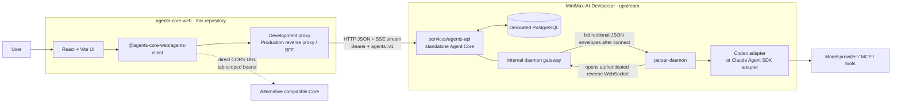
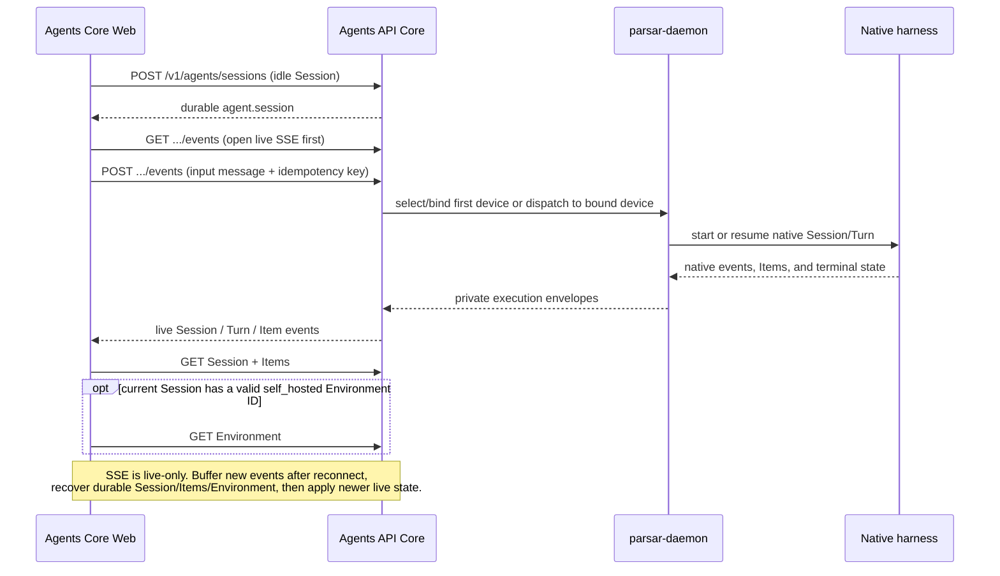

# Architecture

## Decision

Agents Core Web is a protocol-facing TypeScript application, not a second Agent runtime.
It owns the open-source web experience and a reusable client for the HTTP resources
it consumes. The standalone Agent Core, persistence, scheduling, execution devices,
and native harness adapters remain upstream in
[MiniMax-AI-Dev/parsar](https://github.com/MiniMax-AI-Dev/parsar).

This boundary is intentional:

- this repository can release and deploy its Web independently;
- Parsar `services/agents-api` can be deployed without the Parsar product service;
- another Core can replace Parsar only when it implements the same tested HTTP/SSE
  subset;
- Core fixes and runtime-provider work are contributed upstream instead of copied or
  simulated in Web.

The current compatibility audit baseline is Parsar
[`d91ba48a`](https://github.com/MiniMax-AI-Dev/parsar/commit/d91ba48ac6c49cfdf6f08d7687b9be76ba6d53ee),
whose contract is pinned to `openai-python` 3.13.0 commit
[`d7c41efe`](https://github.com/openai/openai-python/tree/d7c41efee1b0802b79f3f88a678ef2052b06e9ce/src/openai/resources/beta/agents).
This is a fixed beta subset, not a claim that every current OpenAI Agents API
resource or hosted-service behavior is implemented.

## System context

The Parsar product stack is deliberately outside this runtime graph. There is no
product-login, product-database, or organization-service dependency in this open Web
deployment. A future Web Cloud service may add its own BFF and user/org policy, but
that is a separate product layer.

## Ownership

| Layer | Owns | Does not own |
| --- | --- | --- |
| Agents Core Web | navigation, Agent forms, Session timeline, live-state projection, reconnect recovery, function-result UI | durable truth, engine selection, sandbox or provider credentials |
| `@agents-core-web/agents-client` | `/v1/agents/**` wire types, beta/auth headers, pagination, strict Environment retrieval, fetch-based SSE parsing | uncertain-write retries, native protocol translation |
| Agent Core | principal authentication, validation, idempotency, durable Agent/Session/Turn/Item state, live events, scheduling | product organization UI or Web user sessions |
| `parsar-daemon` | device connection, host capability advertisement, native process lifecycle and translation | public Agents HTTP semantics or product policy |
| Native adapter | Codex app-server or Claude Agent SDK integration | public API and Web deployment policy |
| Runtime/environment provider | allocation, attach, lease, recovery, cancellation, cleanup | conversation-resource semantics |

Docker, E2B, and AWS Bedrock AgentCore Runtime are possible core/runtime
implementations, not browser transports. Agents Core Web does not implement those adapters.
It may expose an option later only after the connected Core publishes a versioned
capability and its lifecycle behavior is verified.

## Protocol layers

| Boundary | Wire protocol | Authentication | Contract owner |
| --- | --- | --- | --- |
| Browser → proxy/BFF | Same-origin HTTP under `/v1` | Web deployment policy; local proxy holds a Core bearer | Agents Core Web deployment |
| Proxy/BFF → Core | HTTP JSON and SSE passthrough under `/v1/agents/**` | `Authorization: Bearer …`; `OpenAI-Beta: agents=v1` | Pinned Agents API subset |
| Core ↔ daemon | Private reverse WebSocket, Parsar JSON envelope protocol | Separate device credential | Parsar internal protocol |
| Daemon ↔ Codex | `codex app-server --stdio`; JSON-RPC 2.0 over newline-delimited JSON | Native host configuration | Codex adapter |
| Daemon ↔ Claude | Packaged Claude Agent SDK bridge | Native host configuration | Claude adapter |
| Harness ↔ model/tools | Provider-native APIs, MCP, and tool protocols | Provider credential on executor host | Selected harness/provider |

These interfaces are not interchangeable. In particular:

- the daemon WebSocket URL is not an Agents API base URL;
- OpenAI Agents API is not the same thing as OpenAI Agents SDK or Responses API;
- saving a model ID does not select an executor or prove provider availability;
- multiple saved Agents do not imply protocol multi-agent/Subagent support.

OpenAI's official [Agents guide](https://developers.openai.com/api/docs/guides/agents)
describes Agents API as an OpenAI-managed Codex harness, Agents SDK as an application-
hosted agent loop, and Responses API as the lower-level model interface. Parsar uses
the pinned Agents API resource shape while supplying its own Core and execution path.

## Session flow

Creating an idle Session before sending the first message lets the browser open the
live stream before work starts. A successful submission means Core admitted the
event; it is not by itself proof that a native Turn completed.

Core persists the authoritative Session, Turn, Item, and supported Environment views.
Reconnecting SSE does not replay missed events, including when `Last-Event-ID` is
sent. The current UI therefore reconnects, buffers newly arriving events, retrieves
the Session and Items, retrieves Environment only after that Session supplies a valid
`self_hosted` ID, then applies newer buffered live state. A failed or malformed
Environment read degrades only the Environment panel to unavailable. Core generation,
Session and Environment identity, request/event revisions, stream epoch, selection,
and abort checks reject late state. The TypeScript client exposes Turn list/retrieve
for diagnostics, but the current UI does not use them in recovery.

The client never retries an uncertain write automatically. It keeps a failed
message payload and idempotency key in memory only for an explicit byte-for-byte
unchanged manual resend. Editing the payload, changing Session/Core, receiving a
successful exact HTTP 204, or receiving a permanent rejection creates a new
operation. Any other 2xx fails closed and remains uncertain because the documented
Session events contract admits writes only with 204.

## Runtime profiles

The Web currently creates `environment: {"type":"none"}` Sessions. Parsar
`d91ba48a` also exposes Session-bound `self_hosted` data and documented event inputs.
The Web does not create or connect that profile, but for an already selected
self-hosted Session it reads the durable
Environment's exact safe projection and status. Durable `expired` and live-only
`ready` remain separate states; empty installation arrays do not describe a host or
Workspace. This profile is not equivalent to the internal daemon socket, Docker,
E2B, or AWS Bedrock AgentCore Runtime.

`AGENTS_API_ENGINE` selects `codex` by default or the operator-enabled `claude_sdk`
profile for new Sessions. The request's model is passed to that engine; it is not an
engine selector. The engine is fixed at Session creation. Core selects and stores a
device binding on first dispatch; subsequent Turns retain that binding and are not
transparently migrated to a replacement device.

## Authentication and deployment

The current standalone Core authenticates an execution principal, not a Parsar
product user. Its key binding includes tenant, organization, project, subject kind,
subject ID, and the digest of a caller bearer. These are explicit operator-assigned
execution identities; they do not acquire product-user rights.

The local deployment uses four distinct secret boundaries:

1. the Vite proxy reads a plaintext `web-token` and injects the Core bearer;
2. Core reads `keys.json`, which contains principal metadata and only the token digest;
3. `parsar-daemon` reads an independently generated device `auth.json`;
4. Codex, Claude, or a provider reads its own credential on the execution host.

The browser defaults to same-origin `/v1`. A manual token for a direct Core URL is a
development fallback held only in the current tab's `sessionStorage`. The pinned
stock Parsar Core does not install CORS middleware, so direct browser URLs work only
with another compatible Core or proxy that explicitly allows the Web origin, methods,
and headers. Never put any credential in a `VITE_*` variable, `localStorage`, URL,
Session metadata, fixture, snapshot, log, or Git.

For Codex execution, the daemon assigns a managed `CODEX_HOME` to each Agent Session.
A login stored only in the operator's normal `~/.codex/auth.json` is not automatically
inherited. Prefer credentials inherited by the daemon process or a reviewed
provisioning mechanism; a manual file copy is only a controlled local smoke-test
workaround.

The development proxy is loopback-only convenience, not a production security
boundary. Production must terminate TLS, authenticate Web users, authorize requests,
and hold the Core bearer in a reverse proxy/BFF. Use the immutable
[current Parsar setup guide](https://github.com/MiniMax-AI-Dev/parsar/blob/d91ba48ac6c49cfdf6f08d7687b9be76ba6d53ee/services/agents-api/README.md#standalone-http-service)
for Core lifecycle and treat [Connecting Agent Core](core-connection.md) as a legacy
Web runbook pinned to the older revision stated at its top.

## Sources

- [Official OpenAI Agents guide](https://developers.openai.com/api/docs/guides/agents)
- [Official OpenAI Agents API overview](https://developers.openai.com/api/docs/guides/agents-api/overview)
- [Official OpenAI Session lifecycle](https://developers.openai.com/api/docs/guides/agents-api/sessions)
- [Pinned `openai-python` Agents resources](https://github.com/openai/openai-python/tree/d7c41efee1b0802b79f3f88a678ef2052b06e9ce/src/openai/resources/beta/agents)
- [Parsar Agents API contract at `d91ba48a`](https://github.com/MiniMax-AI-Dev/parsar/blob/d91ba48ac6c49cfdf6f08d7687b9be76ba6d53ee/contracts/agents-api/README.md)
- [Parsar Environment contract at `d91ba48a`](https://github.com/MiniMax-AI-Dev/parsar/blob/d91ba48ac6c49cfdf6f08d7687b9be76ba6d53ee/contracts/agents-api/environments.md)
- [Parsar standalone service guide at `d91ba48a`](https://github.com/MiniMax-AI-Dev/parsar/blob/d91ba48ac6c49cfdf6f08d7687b9be76ba6d53ee/services/agents-api/README.md)
