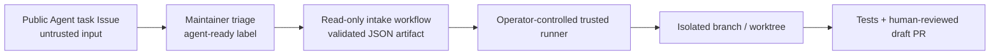

# Issue-driven self-iteration contract

This experiment separates public, reviewable automation from private runner policy
and treats every Issue as untrusted task input.

## Trust model



The label makes a task eligible for a bounded run. It does not make Issue text
trusted code and does not grant credentials, repository expansion, destructive
actions, paid calls, merge, release, or deployment authority.

## Public intake contract

The Agent task form creates a candidate. It must state:

- context and observable outcome;
- acceptance criteria;
- required validation;
- explicit non-goals.

After triage, a maintainer applies `agent-ready`. The workflow
`.github/workflows/agent-issue-intake.yml` then runs with read-only repository and
issue permissions. It parses the event as data, validates the required sections, and
uploads a seven-day `agent-task-<number>` JSON artifact.

The public workflow does not run an Agent, interpolate Issue text into shell, persist
credentials, push a branch, modify the Issue, open a pull request, or merge anything.

Immediately before work, a trusted runner must independently verify that the Issue is
still open, still belongs to this repository, and still has `agent-ready`. Artifacts,
comments, links, attachments, and quoted documents remain untrusted data.

## Private local policy

Run:

```bash
pnpm agent:workspace
```

This prepares:

```text
.agents/
├── AGENTS.md          private repository implementation policy
├── issue-agent.md     private issue iteration prompt and stop conditions
└── state/             local plans, receipts, and transient run state
```

The bootstrap preserves existing file contents, restricts directories to mode `0700`
and prompt files to `0600`, and never adds them to Git.

On a fresh checkout the two files contain starter placeholders only. The operator must
provide the actual local policy and prompt; embedding that private content in the
committed bootstrap would defeat the ignore boundary.

`.agents/AGENTS.md` is **not** a repository-root `AGENTS.md` and is not loaded
automatically by ordinary tooling. The operator-controlled runner must explicitly
load both `.agents/AGENTS.md` and `.agents/issue-agent.md` before it consumes a task
artifact. A runner that cannot prove that loading step must not start autonomous
work.

The entire `.agents/` directory and the root names `AGENTS.md` and `ISSUE_AGENT.md`
are ignored. Never weaken that boundary with `git add -f`, generated copies, artifact
uploads, logs, or pull-request text. Public engineering decisions belong in `docs/`,
while credentials belong in an external secret store—not in `.agents/`.

## Trusted runner contract

A separately configured runner may:

1. validate a successful intake artifact and re-check live Issue eligibility;
2. restate the bounded outcome, non-goals, affected files, and validation plan;
3. create an isolated branch/worktree;
4. inspect this repository and read Parsar upstream source without modifying it;
5. implement only Web, TypeScript client, test, or public-documentation work;
6. run focused checks and `pnpm check`;
7. open a draft pull request only when the runner invocation authorizes it.

It must preserve the Web/Core boundary. If a correct fix belongs to Parsar
`services/agents-api`, `parsar-daemon`, a native harness, or an Environment Provider,
the runner stops and returns a source-grounded upstream gap instead of implementing a
browser workaround or copying Core code.

The runner must also stop for ambiguous scope, conflicting instructions, secrets,
unrelated working-tree overlap, destructive actions, unapproved external writes or
paid calls, unverifiable upstream contracts, failed security checks, or any requested
merge/release/deployment. Human review remains mandatory.

## Handoff packet

The normalized intake artifact contains only repository/Issue identity, author
metadata, the reviewed form fields, and `untrusted_input: true`. It is an intake
record, not executable instructions.

A completed runner handoff should report:

- changed public files and the outcome;
- each acceptance criterion and its evidence;
- checks run and exact results;
- the immutable Parsar/OpenAI contract revision used when relevant;
- remaining limitations and upstream gaps;
- whether a draft pull request was created under explicit authority.

Merge, release, deployment, and deletion of material data always remain separate
human-authorized actions.
